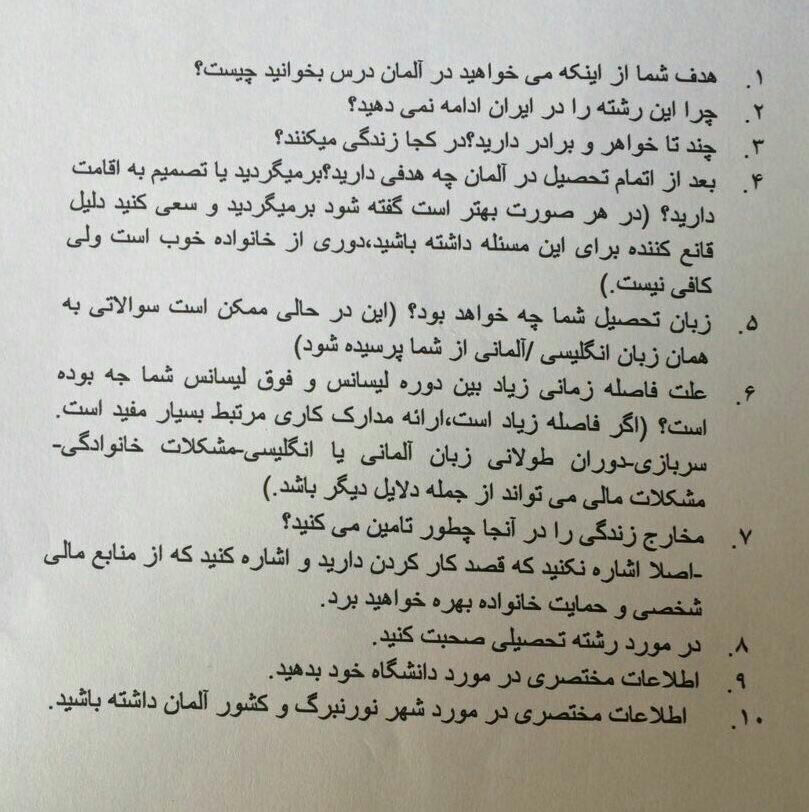

##️ سوالات روز مصاحبه به زبان فارسی
سن
رشته تحصیلی
شغل
نحوه آشنایی با همسر
برنامه آینده در آلمان
نحوه ارتباط با همسر و هر چند وقت یکبار
نحوه آشنایی با همسر
مدت زمان ازدواج
هر دو ازدواج اولتون بوده
مدت زمان خروج همسر از ایران
تو مدت زمانی که همسرتون ایران نبودن آیا همدیگرو دیدن یا نه
تعداد فرزند
تا به حال آلمان بودین یا نه

▪️ سوالاتی که به زبان آلمانی پرسیده میشوند:
(سوالات در سطح A1 هستند)
خودتون رو معرفی کنین
شغل
سن
تعداد خواهر وبرادر
و ...

■ممکن است اصلا به زبان آلمانی از شما سوالی پرسیده نشود.

From <@septmpeyvast>

خیلیا استرس دارن که روز مصاحبه ازشون چی می پرسن. در جریان باشید که مصاحبه ویزای دانشجویی مثل کنکور نیست که نمونه سوال داشته باشه یا سوال تخصصی ازتون بپرسن. یه سری سوال ساده می پرسن ازتون. 

1. چند تا خواهر برادر داری؟ چه کار می کنن؟ کجان؟

2. با کی زندگی می کنی؟

3. همسرت کجاست؟ چه کار می کنه؟ می خواد باید باهات؟ 

4. کسی رو تو آلمان داری؟ 

5. چرا آلمان می خوای بری؟

6. چرا این رشته؟ چرا این دانشگاه؟ راجع به رشتت توضیح بده یکم 

7. چرا دوباره می خوای ارشد بخونی؟

8. از اونایی که گپ چند ساله دارن می پرسن چرا بعد از این همه سال می خوای بری؟ 

9. پدر و مادرت کجان؟ چه کار می کنن؟

10. چند وقته آلمانی می خونی؟

11. هزینتو چجوری تامین می کنی؟ 

خلاصه از این دست سوالات. اون وسطا هم راجع به مدارک تحصیلی ممکنه سوالاتی مثل سال اخذ و معدل و اینجوری چیزا رو بپرسن. 

✅ ممکنه یک یا چند تا سوالو به زبان پذیرش ازتون بپرسن. پس اگه پذیرش آلمانی دارین برای جواب دادن به این نوع سوالا به آلمانی آماده باشین و اگه انگلیسیه پذیرشتون به انگلیسی آماده باشین

✅ اگه فامیلی دارین که پناهندست، فرقی نمی کنه کی پناهنده شده، ازش حرفی نزنین مگه اینکه فامیل درجه یک باشه

#سوالات_روز_مصاحبه 
#مصاحبه_دانشجویی 

@septm
