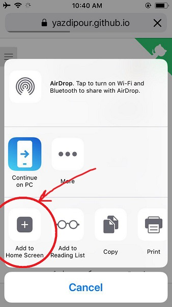
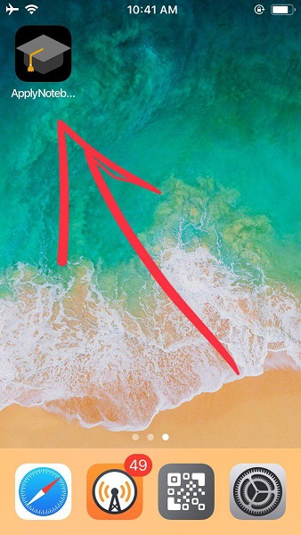

<h1 align="center"> 🎓 دفترچه اپلای </h1>

مطالب مربوط به اپلای تحصیلی که طی مدتی در وان_نوت ام ذخیره میکردم رو اوردم اینجا.

سعی کردم منابع رو تا اونجا که در توان داشتم پیدا کنم و در فایل مطلب بیان کنم.

هیچ مسئولیتی در قبال نادرستی مطالب گردن نمیگیرم. ( همیشه خودتون سرچ کنید مطمئن بشید)

## فهرست

### مدارک

* [CV & Resume](Documents/RESUME.md)
    * [CV Samples](https://github.com/yazdipour/apply-notebook/tree/master/Documents/CV_Sample)
    * [Resume Samples](https://github.com/yazdipour/apply-notebook/tree/master/Documents/Resume_Sample)
    * [CV + Admission Result of Peoples](https://github.com/yazdipour/apply-notebook/tree/master/Documents/Profiles)
* [MotivationLetter Samples](https://github.com/yazdipour/apply-notebook/tree/master/Documents/MotivationLetter)
* [SOP](Documents/SOP.md)
    * [SOP Samples](https://github.com/yazdipour/apply-notebook/tree/master/Documents/SOP_Sample)
* [**آزادکردن_مدارک**](Documents/آزادکردن_مدارک.md)

### امتحانات

* [TOFEL](Exams/TOFEL.md)
* [GRE](Exams/GRE.md)
    * [GRE References](https://github.com/yazdipour/apply-notebook/tree/master/Exams)

### بر اساس کشور

* [اطلاعات سفارت ها](_/EmbassyInfo.md)
* [USA 🇺🇸](Countries/USA/README.md)
* [Canada 🇨🇦](Countries/Canada/README.md)
* [Germany 🇩🇪](Countries/Germany/README.md)
* [Italy 🇮🇹](Countries/Italy/README.md)
* [Norway 🇳🇴](Countries/Norway/README.md)
* [Sweden 🇸🇪](Countries/Sweden/README.md)
* [Australia🦘](Countries/Australia/README.md)

### متفرقه

* [FUND](_/FUND_SITES.md)
* [تجربه_معافیت_تحصیلی](https://github.com/yazdipour/apply-notebook/raw/master/_/تجربه_معافیت_تحصیلی.png)
* [نمونه ایمیل](_/Mail.md)
* [کار](_/Job_Fund.md)
* [سایت_های_کاربردی_برای_دانشجویان_و_پژوهشگران](_/سایت_های_کاربردی_برای_دانشجویان_و_پژوهشگران.md)
* [معافیت_عوارض_خروج](_/معافیت_عوارض_خروج.md)
* [معیار_سنجش_اعتبار_مقاله](_/معیار_سنجش_اعتبار_مقاله.md)
* [نحوه_گرفتن_پاسپورت](_/نحوه_گرفتن_پاسپورت.md)
* [Application Fee Waiver](_/fee_waiver.md)

### منابع و لینک ها

[منابع و لینک ها](_/ref.md)

### کمک مالی

[کمک به رفقیتون](https://yazdipour.github.io/donate/)

## همکاری

اگر قصد اضافه کردن مطلب یا تصحیح مطلبی رو دارید در این صفحه بیان کنید

https://github.com/yazdipour/apply-notebook/issues/new

## نصب روی گوشی

این منبع رو میتونید مانند اپلیکیشن در گوشی iOS و یا Android خودتون داشته باشید.

کافیه وارد صفحه اصلی [https://yazdipour.github.io/apply-notebook](https://yazdipour.github.io/apply-notebook) بشید و صفحه رو پین کنید.

این صفحه بصورت PWA طراحی شده. پس به راحتی میتونید از اون بصورت Offline هم استفاده کنید.

| ||
|-|-|
| | 
